# 🎬 Netflix Content Strategy Analysis
### A Full-Stack Data Analytics Project | Python → SQL → Power BI

---

## 📌 Project Overview

This project performs a comprehensive business intelligence 
analysis of Netflix's content catalog using real-world data 
from Kaggle. The analysis goes beyond basic exploration — 
every query is framed around a real executive business 
question that Netflix's strategy team would actually ask.

The project follows a complete data analytics workflow:

**Raw Data → Python Cleaning → SQL Analysis → Power BI Dashboard**

---

## 🛠️ Tools & Technologies

| Tool | Purpose |
|------|---------|
| Python (Google Colab) | Data cleaning & preparation |
| Pandas | Data manipulation |
| DB Browser for SQLite | SQL analysis |
| Power BI Desktop | Interactive dashboard |
| GitHub | Version control & portfolio |

---

## 🔄 Complete Workflow

Step 1 → Raw Data        (Kaggle Netflix Dataset)
Step 2 → Python Cleaning (Google Colab)
Step 3 → SQL Analysis    (14 Business Themes)
Step 4 → Power BI        (4 Page Dashboard)

---

## 🐍 Python Cleaning (Google Colab)

### Libraries Used
```python
import pandas as pd
import numpy as np
```

### Raw Data Issues Fixed
| Column | Issue | Action |
|--------|-------|--------|
| director | 2634 missing values | Filled with 'Unknown' |
| country | 831 missing values | Filled with 'Unknown' |
| cast | 825 missing values | Filled with 'Unknown' |
| rating | 4 missing values | Filled with 'Not Rated' |
| date_added | 10 missing values | Dropped rows |
| duration | 3 missing values | Dropped rows |
| date_added | Stored as text | Converted to datetime |
| duration | Number + text mixed | Split into value + unit |
| year_added | 14 negative gaps | Filtered out |

### Final Result
| Before Cleaning | After Cleaning |
|----------------|----------------|
| 8,807 rows | 8,793 rows |
| 12 columns | 16 columns |
| Mixed data types | All correct types |
| Missing values | Fully handled |

---

## 🔍 SQL Analysis — 14 Business Themes

### 📺 Content Pillar

#### Theme 1 — Content Format Strategy
**Executive Question:** Are we pivoting from Movies to
TV Shows for longer user retention?

**Key Insight:** Netflix operated as Heavy Movie Investment
platform from 2008-2014. TV Show Momentum first appeared
in 2015 with 420% growth peaking at 576% in 2016.
TV Show Momentum returned in 2020 and held through 2021
confirming Netflix's long term pivot toward retention
driven TV content.


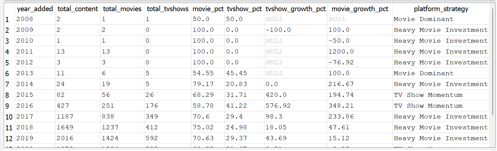

---

#### Theme 2 — Speed to Platform
**Executive Question:** Are we acquiring fresh premium
content or cheap old catalogs?

**Key Insight:** 63% of Netflix content arrives within
2 years of its original release confirming premium
acquisition strategy. Only 13.72% is vintage content.


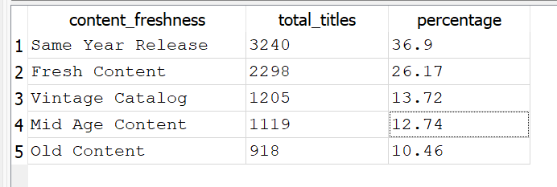

---

#### Theme 3 — Legacy vs Modern Library
**Executive Question:** Are we buying cheap vintage
catalogs or funding expensive new originals?

**Key Insight:** 84.85% of Netflix catalog comes from
2010 onwards. Netflix positions itself as a premium
modern platform not a cheap vintage catalog service.


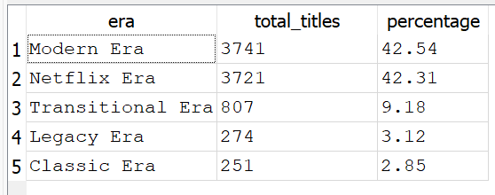

---

#### Theme 7 — Feature Film Pacing
**Executive Question:** Are movies getting shorter to
match shrinking attention spans?

**Key Insight:** Netflix movies shrunk by 18 minutes
over 20 years from 111 mins in 2000 to historic low
of 93 mins in 2019.


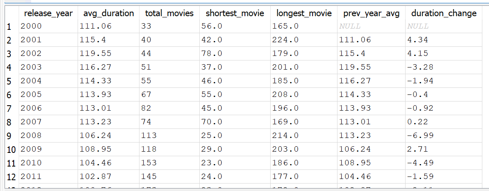

---

#### Theme 10 — Genre Saturation & Gaps
**Executive Question:** Which genres are over saturated
and where are the untapped gaps?

**Key Insight:** International Movies Dramas and Comedies
account for 63% of all titles. Biggest gaps: Horror (92)
Science & Nature (77) and Romantic Movies with only 6
titles.

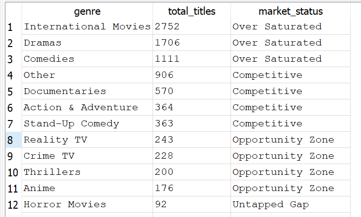

---

### 📈 Growth Pillar

#### Theme 5 — Content Seasonality
**Executive Question:** Does Netflix weaponize holiday
months to spike content drops?

**Key Insight:** Netflix peaks in July (827 titles)
confirming deliberate summer strategy. February is
weakest month with only 563 titles.

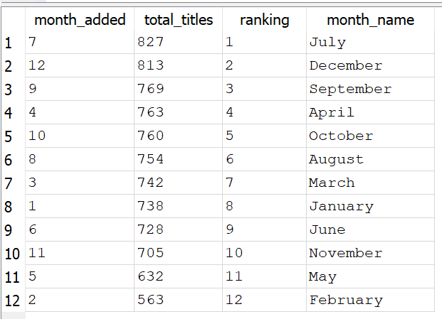

---

#### Theme 6 — Global Market Dominance
**Executive Question:** Which countries dominate the
content pipeline?

**Key Insight:** US leads with 2809 titles (32%) but
India closing fast at 972 (11%). Asian markets are TV
Show powerhouses — South Korea 79.4% Japan 68.85%.

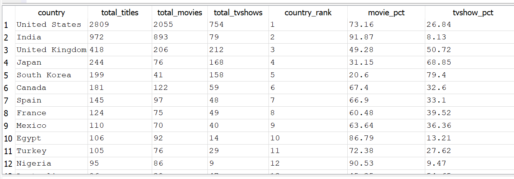

---

#### Theme 8 — Platform Growth Velocity
**Executive Question:** Is content acquisition
accelerating peaking or dying?

**Key Insight:** Netflix experienced 3 consecutive years
of Hyper Growth 2015-2017 peaking at +420% in 2016.
COVID triggered first ever consecutive decline in
2020 and 2021.

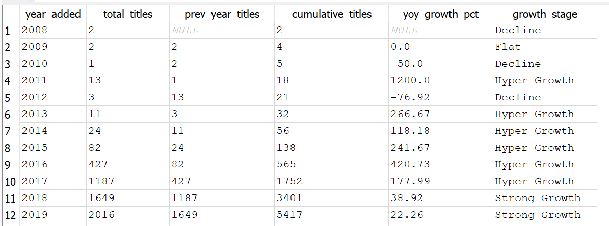

---

#### Theme 9 — The International Pivot
**Executive Question:** In what exact year did Netflix
shift from US-centric to Global?

**Key Insight:** Netflix flipped from US Dominant
(60.98%) to International Dominant (58.78%) in a
single year 2016 — one of the most decisive strategic
pivots in streaming history.

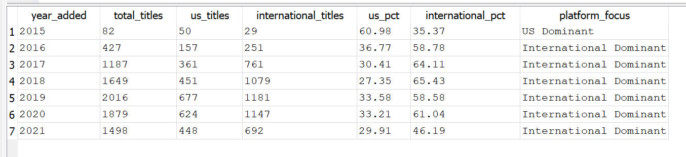

---

### 👥 Audience Pillar

#### Theme 4 — Audience Segmentation
**Executive Question:** Is Netflix abandoning Kids/Family
to chase high paying adults?

**Key Insight:** 88.72% of content targets Adults and
Teenagers. Kids & Family represents only 10.23%
confirming Netflix deliberately positions against
Disney+ by focusing on premium adult subscribers.

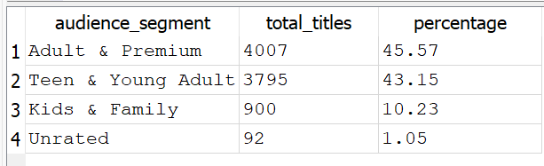

---

#### Theme 11 — Audience Monetization Funnel
**Executive Question:** How aggressively is Netflix
scaling TV-MA content to drive signups?

**Key Insight:** Netflix maintained consistent Moderate
Adult Push keeping TV-MA between 32-39% without ever
crossing 40% threshold.

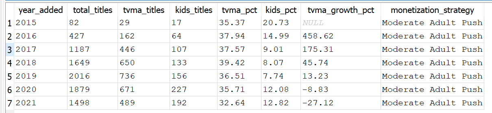

---

#### Theme 12 — Country vs Rating Intelligence
**Executive Question:** Do Eastern vs Western markets
need different content strategies?

**Key Insight:** Every Western market is TV-MA dominant.
All Eastern markets are TV-14 dominant requiring
completely different regional strategies.

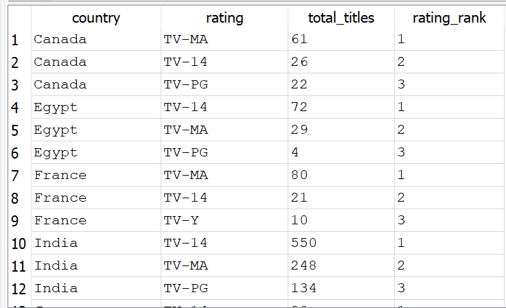

---

### 💰 Risk & Investment Pillar

#### Theme 13 — VIP Talent & Director ROI
**Executive Question:** Who are the most reliable
collaborators deserving big contracts?

**Key Insight:** India's Rajiv Chilaka is Netflix's most
productive director with 19 titles outranking Hollywood
legends Scorsese (12) and Spielberg (11).

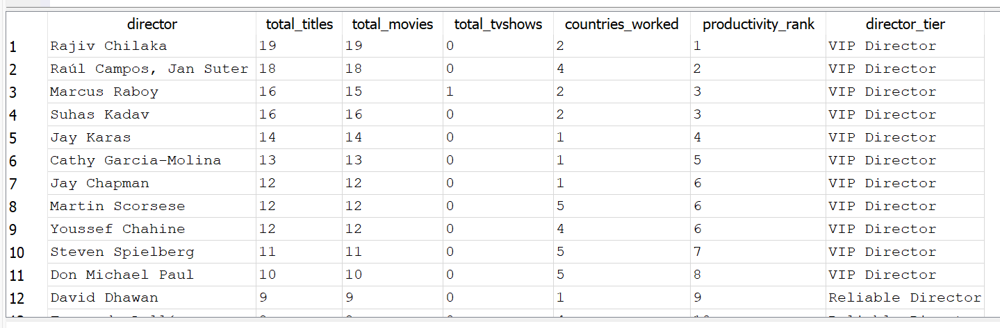

---

#### Theme 14 — One Season Cancellation Risk
**Executive Question:** Are we burning money on
multi-season epics or 1-season tests?

**Key Insight:** 67.25% of all shows receive just 1
season meaning Netflix cancels 76% of content after
the initial test. Only 2.36% achieve Legacy Franchise
status.

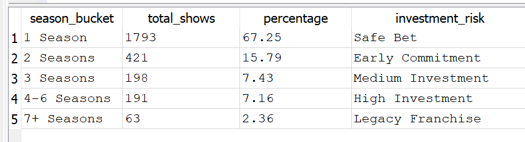

---

## 📊 Power BI Dashboard

### 4 Page Interactive Dashboard

| Page | Focus |
|------|-------|
| Executive Summary | Platform overview & KPIs |
| Content Strategy | Format genre duration trends |
| Global Analysis | Country rating market insights |
| Risk & Investment | Director ROI cancellation risk |

### Dashboard Screenshots

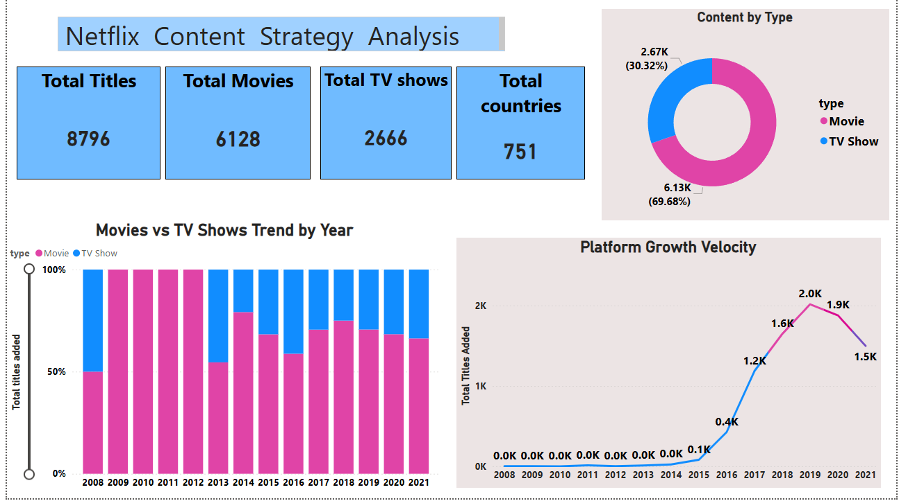
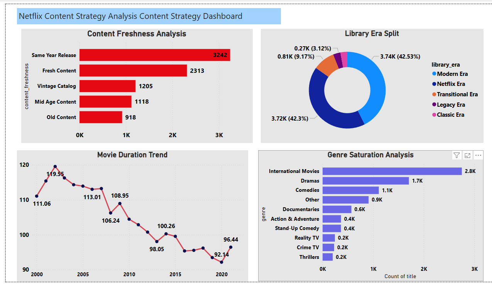
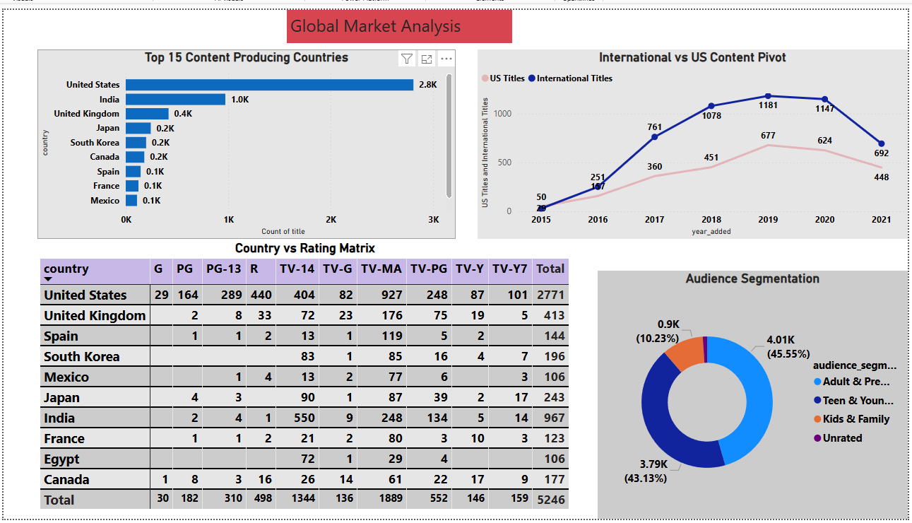
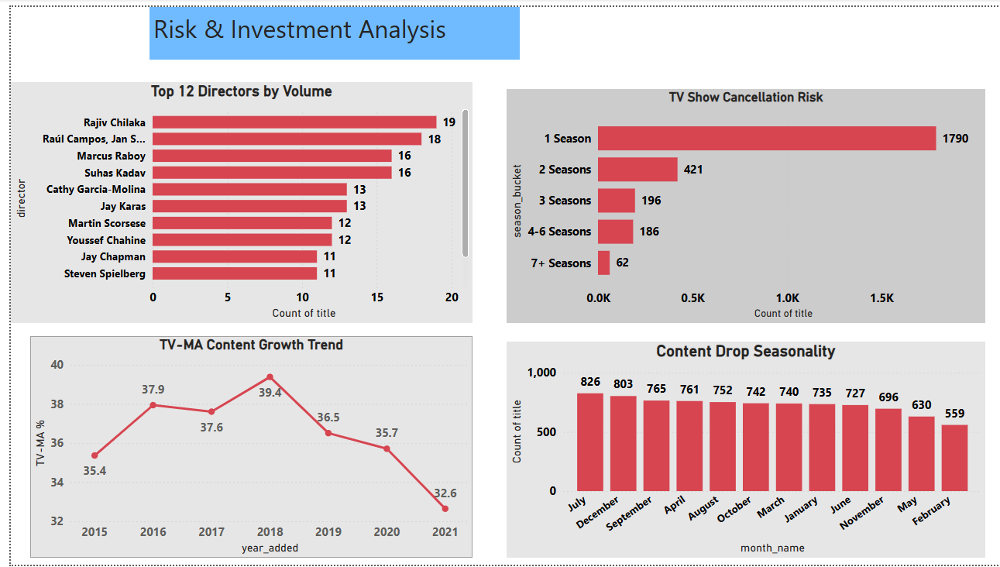

### Download Dashboard
📥 [Download Power BI File (.pbix)](netflix%20full%20analysis%20final.pbix)

---

## 💡 Top 5 Key Findings

1.2016 was Netflix's most important year ever
→ Hyper Growth (+420%)
→ International Pivot confirmed
→ TV Show Momentum begins
2.Netflix is a Premium Modern Adult platform
→ 84% modern content
→ 63% fresh acquisitions
→ 88% adult/teen audience
3.East vs West content divide confirmed
→ Western markets = TV-MA dominant
→ Eastern markets = TV-14 dominant
4.Netflix plays it safe with TV Shows
→ 67% of shows get only 1 season
→ 76% cancelled after season 1
5.Genre gaps = huge opportunities
→ Horror only 92 titles
→ Romantic Movies only 6 titles

## 📁 Repository Structure
Netflix-Content-Strategy-Analysis/
│
├── dashboard/          ← Power BI screenshots
├── datasets/           ← Kaggle dataset info
├── images/             ← SQL result screenshots
├── sql analysis/       ← 14 SQL query files
├── netflix_cleaned.csv ← Cleaned dataset
├── netflix full analysis final.pbix ← Power BI file
└── README.md           ← This file

---

## 📁 Dataset

| Detail | Info |
|--------|------|
| Source | Kaggle |
| Dataset | Netflix Movies and TV Shows |
| Link | [Download Here](https://www.kaggle.com/datasets/shivamb/netflix-shows) |
| Raw Rows | 8,807 |
| After Cleaning | 8,793 rows |

---

## 👤 Author

**Tekchamchingkhei**
Data Analyst | Python | SQL | Power BI

🔗 [LinkedIn](https://www.linkedin.com/in/chingkheinganba-meitei-8208a624a)
🐱 [GitHub](https://github.com/tekchamchingkhei-a11y)

---

⭐ If you found this project useful please star the repository!
